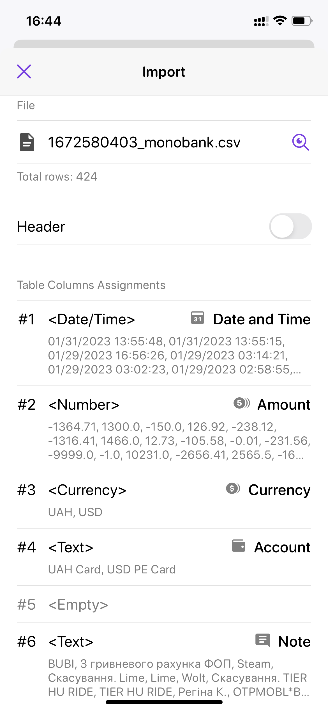

<h1>Monobank + MoneyFlow = 💕</h1>
A tool for syncing Monobank transactions with Money Flow app

## Getting Started

### Install dependencies

```sh
poetry install
```

### Export transactions

<a href="https://api.monobank.ua/docs/#tag/Kliyentski-personalni-dani/paths/~1personal~1statement~1{account}~1{from}~1{to}/get">Monobank API</a>
has a limit of exprorting transactions (31 days past), <ins><b>this is why we need to select the time range of export</b></ins>

#### Syntax

```sh
poetry run python monoflow/main.py [from] [to]
```

the ***from*** and ***to*** values should be provided as Unix Time in milliseconds

#### Example

```sh
poetry run python monoflow/main.py 1672580403 1675172403
```

Note: [**Use this service to get those range values**](https://www.unixtimestamp.com/)

***

After you've run this command, you'll have `out` folder created with `[timestamp]_monobank.csv` file in it

**Send that to your mobile device 📨**

### Import transactions



1.  Go to **`Settings -> Import -> Choose a file (.csv)`**
2.  Choose a result file of the program
3.  **Make sure you select proper field types as seen on screenshot**
4.  Tap **Continue** button
5.  Adjust transactions if needed
6.  Smash **Import Transactions** button

#### 🔥 Done
